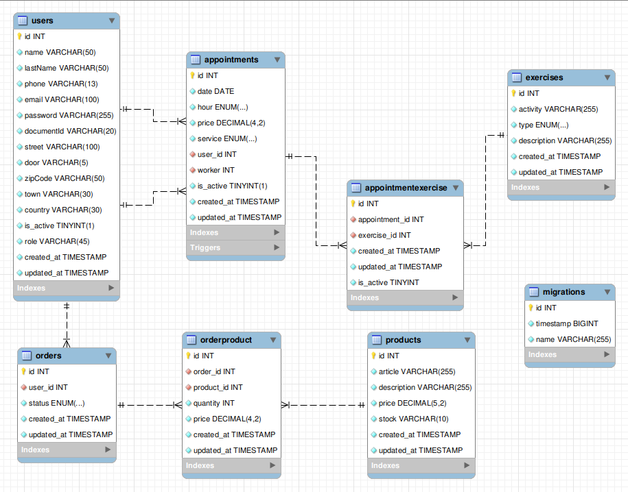

# Backend app
<div align="center">
  
</div>
<div align="center">Pterion physiotherapy and osteopathy clinic</div>
<br></br>
<div>
<a href = "antonioinsa@tutanota.com"></a>
<a href="https://www.linkedin.com/in/antonioinsa/" target="_blank"></a> 
</p>
</div>
<br></br>
<details>
  <summary>Contenido 📝</summary>
  <ol>
    <li><a href="#objetivo">Objetivo</a></li>
    <li><a href="#sobre-el-proyecto">Sobre el proyecto</a></li>
    <li><a href="#stack">Stack</a></li>
    <li><a href="#diagrama-bd">Diagrama</a></li>
    <li><a href="#instalación-en-local">Instalación</a></li>
    <li><a href="#endpoints">Endpoints</a></li>
    <li><a href="#database">DataBase (accesos y registros)</a></li>
    <a></li>
    <li><a href="#mejoras">Mejoras</a></li>
    <li><a href="#licencia">Licencia</a></li>
    
  </ol>
</details>

## Objetivo
Crear una web funcional sobre una clínica de fisioterapia y osteopatía para la gestión de citas y facturas de los clientes registrados.

## Sobre el proyecto
En este proyecto, como clientes, podemos gestionar nuestras citas (crear, actualizar fecha y cancelar).
Cada usuario dispondrá de una cuenta o perfil en el que pueda actualizar sus datos introducidos en el registro inicial. 
Por otro lado, tanto el trabajador como el administrador, disponen de perfiles únicamente para fines profesionales (visualización de citas, facturas, gestión de clientes y gestión de trabajadores).

Se esta trabajando con tres roles (user, admin y superAdmin), siendo el superAdmin o administrador el que tiene acceso a todo y el admin o trabajador unicamente a su perfil donde podra ver sus citas con los clientes, añadir ejercicios de respaldo a las citas para que los clientes puedan realizar en sus casa, ya que se componen de videos explicativos sobre ejercicios de estiramientos y editar su propio perfil. Por ultimo el user o cliente puede solicitar citas, actualizar su fecha, cancelarlas o consultarlas mediante calendario. Tambien puede editar su perfil, ver las facturas de cada cita y los ejercicios que le añadio el trabajador a su cita.

## Stack
Tecnologías utilizadas:
<div align="center">

<a href="https://www.expressjs.com/">
    
</a>
<a href="https://nodejs.org/es/">
    
</a>
<a href="https://www.typescriptlang.org/">
    
</a>
<a href="https://www.postman.com/">
    
</a>
<a href="https://www.mysql.com/">
    
</a>
<a href="https://git-scm.com/">
    
</a>
<a href="https://www.github.com/">
    
</a>
<a href="https://jwt.io/">
    
</a>
 </div>


## Diagrama BD


## Instalación en local
1. Clonar el repositorio
2. ` $ npm install `
3. Conectamos nuestro repositorio con la base de datos 
4. ```$ npx typeorm-ts-node-commonjs migration:run -d ./src/db.ts ```
5. Utilizamos los  <a href="#registros">archivos SQL </a>(insertamos los registros en las diferentes tablas de nuestra DB) 
6. Ejecutamos los <a href="#registros">scripts </a>de los triggers en nuestra base de datos (en mi caso he utilizado MySQLworkbench)
7. ``` $ npm run dev ``` 


## Endpoints
Los endpoints estan realizados con el puerto 3000, cambiar segun configuración
<details>
<summary>Endpoints</summary>


-AUTH

  - Usuarios

    - Registro

            POST http://localhost:3000/register
        body:
        ``` js
            {
            "name": "Medina",
            "lastName": "Delsol Martinez",
            "phone": "689445214",
            "email": "medinas@medina.com",
            "password": "aA@1234",
            "documentId":"19198123A",
            "street": "Miño",
            "door": "158",
            "zipCode": "40100",
            "town": "Alava",
            "country":"España" 
            }
        ```
    - Login

            POST http://localhost:3000/login  
        body:
        ``` js
            {
            "email": "medinas@medina.com",
            "password": "aA@1234"
            }
        ```
    - Cuenta del usuario

            GET http://localhost:3000/account

    - Actualizar datos del perfil

            PUT http://localhost:3000/update
        body:
        ``` js
            {
            "phone": "689445214",
            "email": "medinas@medina.com",
            "password": "aA@1234",
            "street": "Miño",
            "door": "15",
            "zipCode": "46000",
            "town": "Valencia",
            "country":"España" 
            }
        ```
    - Eliminar perfil

            DELETE http://localhost:3000/delete

    - Crear cita

            POST http://localhost:3000/newAppointment
        body:
        ``` js
            {
            "date": "25-12-2024",
            "hour": "09:00",
            "service": "physiotherapy"
            }
        ```
    - Actualizar cita

            PUT http://localhost:3000/updateAppointment
        body:
        ``` js
            {
            "date": "25-11-2024",
            "hour": "09:00",
            "service": "physiotherapy"
            }
        ```
    - Eliminar cita

            DELETE  http://localhost:3000/deleteAppointment/${id} 

    - Todas mis citas

            GET  http://localhost:3000/getAppointments 

    - Todas mis facturas

            GET  http://localhost:3000/myInvoices

    - Actualizar password

            PUT  http://localhost:3000/updatePassword
        body:
        ``` js
            {
            "password":"aA@1234"
            }
        ```

  - TRABAJADORES

    -  Actualizar datos del perfil

            POST http://localhost:3000/worker/profile
        body:
        ``` js
            {
            "phone": "661548996",
            "email": "bradi@bradi.com",
            "street": "Miño",
            "door": "130",
            "password": "aA@1234",
            "zipCode": "46100",
            "town": "Valencia",
            "country": "España"
            }
        ```
    - Citas con los clientes

            GET http://localhost:3000/appointments


  - Administrador

    -  Eliminar usuarios

            DELETE http://localhost:3000/sa/delete/${id} 
        
    - Cambiar el role a los usuarios

            PUT http://localhost:3000/changeRole
        body:
        ``` js
            {
            "id": 3,
            "role": "admin"
            }
        ```

    - Visualizar todas las citas

            GET http://localhost:3000/allAppointments
        
    - Actualizar datos de los trabajadores

            PUT http://localhost:3000/updateWorker
        body:
        ``` js
            {
            "id":7,
            "phone":"773776950",
            "email":"carla@carla.com",
            "street":"Dexter Point",
            "door":8,
            "zipCode":"51079",
            "town":"Lleida",
            "country":"Spain"
            }
        ```

    -  Visualizar solo las citas de fisioterapia (todas)

            GET http://localhost:3000/physiotherapy
        body:
        ``` js
            {
                "date": "2024-11-06T16:20:20.130Z",
                "article": 1,
            }
        ``` 
    -  Visualizar solo las citas de osteopatia (todas)

            GET http://localhost:3000/osteopathy
        body:
        ``` js
            {
                "date": "2024-12-06T16:20:20.130Z"
            }
        ```
     ...
</details>
<br>
<a href="./src/DataBase/http/thunder-collection_Clinic.json">Thunder collection (.json)</a>

<br>

<a href="https://jsonviewer.stack.hu/">Puede visualizar el .json aquí</a>

<p>Tan solo, abralo, copie el contenido del archivo thunder client y peguelo en el visualizador</p>

## DataBase
En este apartado se adjuntan las tablas en formato SQL para  insertar los registros en la base de datos.

Todos los usuarios estan creados con una password generica "aA@1234", para una mayor sencillez a la hora de probar la APP.

<u>Accesos =></u>

**user (login clientes)**

{
  "email": "gsimononsky4@elpais.com",
  "password": "aA@1234"
}

**admin (login trabajadores)**

{
  "email": "jpaunsford1@blogs.com",
  "password": "aA@1234"
}

**superAdmin (login administrador)**

{
  "email": "osumbler2@fastcompany.com",
  "password": "aA@1234"
}

## Registros
<div>
<p><a href="./src/DataBase/users.sql">Click aqui </a>para acceder a users.sql</p>
<p><a href="./src/DataBase/appointments.sql">Click aqui </a>para acceder a citas.sql</p>
<p><a href="./src/DataBase/exercises.sql">Click aqui </a>para acceder a ejercicios.sql</p>
<p><a href="./src/DataBase/script Trigger autoFill admin in appointments table.sql">Click aqui</a> para script de autorrelleno de la columna worker en la tabla appointments</p>
<p><a href="./src/DataBase/script Trigger change is_active when update  in appointments table.sql">Click aqui</a> para script de actualización de la columna is_active en la tabla appointments, este script actualiza is_active por defecto en 1 a 0, para que la cita una vez haya pasado su fecha, pase a ser una factura</p>
</div>


## Mejoras

- Implementación de envio de correo electronico

- El trabajador pueda añadir ejercicios a las citas y los usuarios puedan visualizarlas

- Implementación del e-commerce 

## Licencia
Proyecto desarrollado por Antonio Insa Benavent, bajo licencia MIT.

Consulta el archivo <a href="./LICENSE">`LICENSE`</a> para más información.
